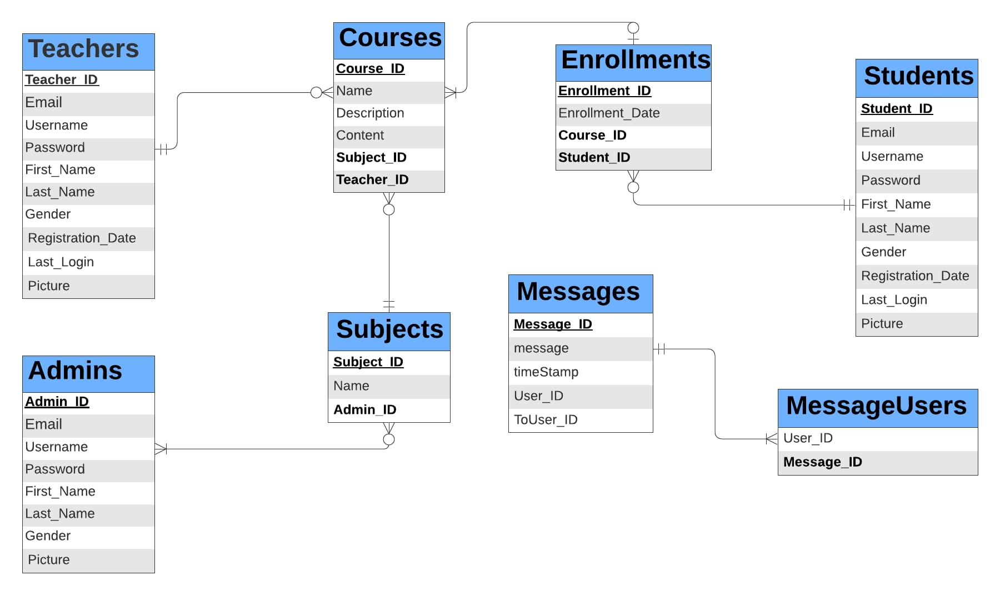
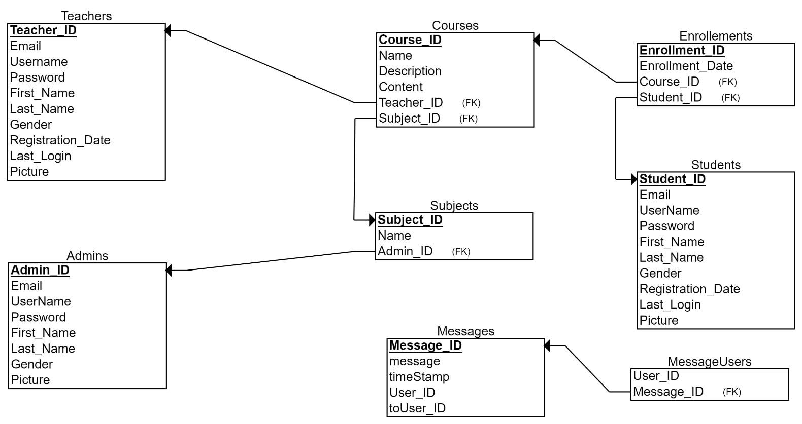

# -E-Learning-System
In this new era of electronics, we know the concept of e-learning which does not include the use of paper and pen. There are many advantages of e-learning system. In this e-learning system we can assign projects to students and can share documents and more easily. This system has three modules including student, faculties and Admin. Students can login, they have access to main menu, calendar, projects, documentation, to upload, view the things uploaded by the faculties, knowledge books, also send messages to faculties. Faculties can login and have access for viewing, uploading documents and projects. Admin can login and manage the faculties and student details and also view projects. This is how the new concept of e-learning came into existence, which is an easier and smarter system for colleges.

⚙️    Hardware Requirements: 
*   Computer with either Intel Pentium processor or AMD processor. 
*   1GB+ DDR RAM 
*   1GB hard disk drive 

💻    Software Requirements: 
*   Windows Operating system. 
*   JRE and JDK. 	
*   MySQL server (WAMP) 

# DESIGN 
Database Design is a collection of processes that facilitate the designing, development, implementation and maintenance of enterprise data management systems. 
It helps produce database systems: 
*   That meet the requirements of the users 
*   Have high performance. 

**Architecture Description**  
The design of a DBMS depends on its architecture. It can be centralized or decentralized or hierarchical. The architecture of a DBMS can be seen as either single tier or multi-tier.  
**ER Diagram**

Fig 1: ER Diagram   
An entity–relationship model describes interrelated things of interest in a specific domain of knowledge (Refer Fig 1). It is composed of entity types and specifies relationships that can exist between instances of those entity types.

**Relational Schema Diagram**

 Fig 2: Relational Schema   
Relational schema is a collection of meta-data. Database schema describes the structure and constraints of data representing in a particular domain (Refer Fig 2).

# IMPLEMENTATION  
**Description on Implementation** 
The goal of this application is to manage the Students, Teachers, Courses and various functions of E-Learning System.

**List of modules with use cases:** 
This Java project consists of 3 major modules
*  ***Admin*** 
   * Admin Login with Username & Password 
   * View Profile 
   * View Account Information 
   * Delete Account 
   * Manage Account (Change email, change name, change profile, change password) 
   * Admin Adds Subject 
   * Admin Deletes Subject 
   * View All Teachers Details and Delete Teacher 
   * View All Students Details and Delete Student 
   * View All Courses Details 
   * Add New Admin 
   * Logout 
*  ***Teacher*** 
   *  Signup 
   *  Teacher Login with Username & Password 
   *  View Profile 
   *  View Account Information 
   *  Delete Account 
   *  Manage Account (Change email, change name, change profile, change password) 
   *  Teacher Adds Course 
   *  View My Students in a Particular course. 
   *  View My Courses 
   *  Update My Course 
   *  Logout 
*  ***Student*** 
   *  Signup 
   *  Student Login with Username & Password 
   *  View Profile 
   *  View Account Information 
   *  Delete Account 
   *  Manage Account (Change email, change name, change profile, change password) 
   *  Student Enrols Courses 
   *  Student Study Courses 
   *  Student Withdraw Courses 
   *  Student Views Participants in a particular course. 
   *  Student can Message any participant in a particular course except Teacher. 
   *  Logout 
